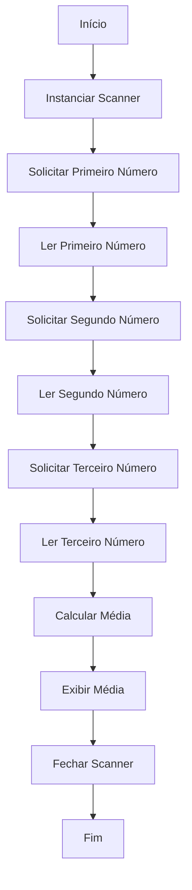

## Desafio 100 dias Codando Java do Básico ao Avançado

# Desafio 1

# Calculadora de Média de Três Números

Este projeto contém um programa em Java que calcula a média de três números fornecidos pelo usuário. O objetivo deste código é demonstrar a entrada de dados do usuário, a realização de operações aritméticas básicas e a exibição do resultado formatado.

## Autor
- **Msouza472**

## Versão
- **1.0**

## Descrição do Código

A classe `Numeros` foi criada para calcular a média de três números fornecidos pelo usuário. O programa solicita que o usuário insira três números inteiros e, em seguida, calcula e exibe a média desses números.

### Funcionalidades
- Solicitar três números inteiros do usuário.
- Calcular a média dos três números.
- Exibir o resultado da média com duas casas decimais.

### Como Executar
Para executar o programa, siga estas etapas:

1. Compile o código:
   ```bash
   javac Numeros.java
   ```

2. Execute o programa:
   ```bash
   java Numeros
   ```

### Exemplo de Uso
Ao executar o programa, você verá uma série de prompts pedindo para inserir três números. Após inserir os números, o programa calculará a média e exibirá o resultado formatado. Veja um exemplo abaixo:

```
Olá digite o primeiro número
5
Olá digite o segundo número
10
Olá digite o terceiro número
15
///// Calculando Média /////
A média dos números fornecidos é igual a: 10.00
```

### Código Fonte

```java
import java.util.Scanner;
/**
 * @author Msouza472
 * @version 1.0
 * 
 * class Numeros
 * criada para calcular a média de três números fornecidos pelo usuário
 */

public class Numeros {

    public static void main(String[] args) {
        Scanner scanner = new Scanner(System.in);

        System.out.println("Olá, digite o primeiro número");
        int numero1 = scanner.nextInt();

        System.out.println("Olá, digite o segundo número");
        int numero2 = scanner.nextInt();

        System.out.println("Olá, digite o terceiro número");
        int numero3 = scanner.nextInt();

        System.out.println("///// Calculando Média /////");

        double media = (numero1 + numero2 + numero3) / 3.0;
            
        System.out.printf("A média dos números fornecidos é igual a: %.2f%n", media);

        scanner.close();
    }
}
```

---

## Fluxograma

