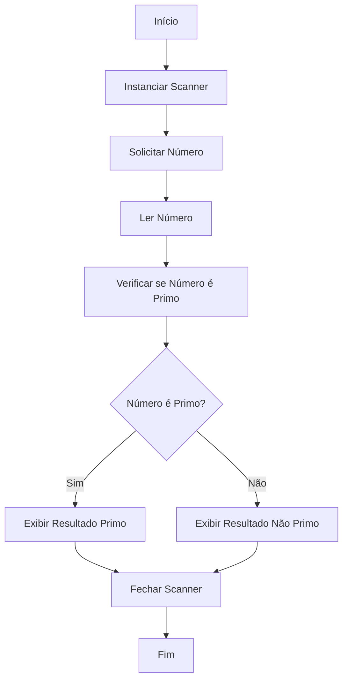

## Desafio 100 dias Codando Java do Básico ao Avançado

# Desafio 2

# Verificação de Número Primo

Este projeto contém um programa em Java que verifica se um número fornecido pelo usuário é primo. O objetivo deste código é demonstrar a lógica de verificação de números primos e a interação com o usuário para entrada de dados.

## Autor
- **Msouza472**

## Versão
- **1.0**

## Descrição do Código

A classe `VerificaNumeroPrimo` foi criada para verificar se um número fornecido pelo usuário é primo. O programa solicita que o usuário insira um número inteiro e, em seguida, determina se o número é primo ou não.

### Funcionalidades
- Solicitar um número inteiro do usuário.
- Verificar se o número é primo.
- Exibir o resultado indicando se o número é primo ou não.

### Como Executar
Para executar o programa, siga estas etapas:

1. Compile o código:
   ```bash
   javac VerificaNumeroPrimo.java
   ```

2. Execute o programa:
   ```bash
   java VerificaNumeroPrimo
   ```

### Exemplo de Uso
Ao executar o programa, você verá um prompt pedindo para inserir um número. Após inserir o número, o programa verificará se é primo e exibirá o resultado. Veja um exemplo abaixo:

```
Por favor, digite o número a ser verificado!
29
O número 29 é PRIMO!
```

### Código Fonte

```java
import java.util.Scanner;

/**
 * O programa recebe um número do usuário e verifica se esse número é primo.
 * 
 * @author Msouza472
 */
public class VerificaNumeroPrimo {
    public static void main(String[] args) {
        Scanner scanner = new Scanner(System.in);

        System.out.println("Por favor, digite o número a ser verificado!");
        int numero = scanner.nextInt();

        // Verifica se o número é primo
        boolean isPrimo = true;
        
        if (numero <= 1) {
            isPrimo = false;  // Números menores ou iguais a 1 não são primos
        } else {
            for (int i = 2; i <= Math.sqrt(numero); i++) {
                if (numero % i == 0) {
                    isPrimo = false;
                    break;
                }
            }
        }

        // Exibe o resultado
        if (isPrimo) {
            System.out.println("O número " + numero + " é PRIMO!");
        } else {
            System.out.println("O número " + numero + " NÃO é primo.");
        }

        scanner.close();
    }
}
```

---

## Fluxograma


