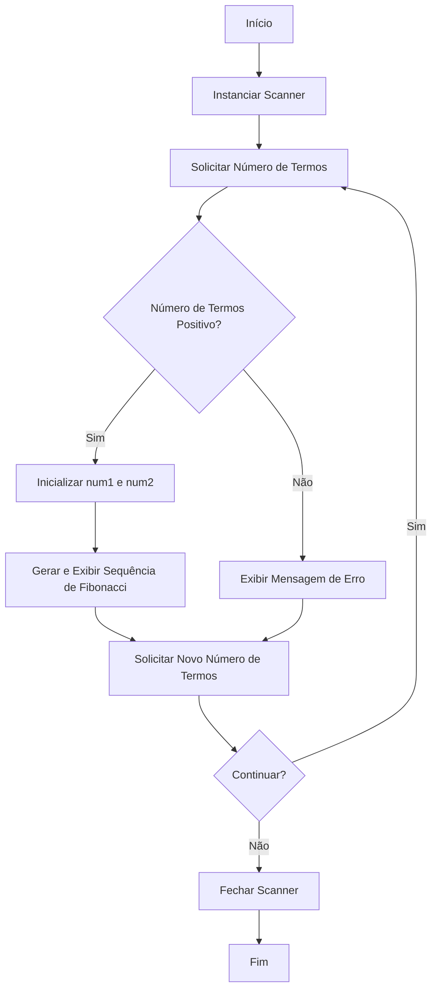

## Desafio 100 dias Codando Java do Básico ao Avançado

# Desafio 3

# Geração da Sequência de Fibonacci

Este projeto contém um programa em Java que gera a sequência de Fibonacci para um número de termos fornecido pelo usuário. O objetivo deste código é demonstrar a geração da sequência de Fibonacci e a interação com o usuário para entrada de dados.

## Autor
- **Msouza472**

## Versão
- **1.0**

## Fluxograma



## Descrição do Código

A classe `Fibonacci` foi criada para gerar a sequência de Fibonacci com base no número de termos fornecido pelo usuário. O programa solicita que o usuário insira um número inteiro positivo, e em seguida, gera e exibe a sequência de Fibonacci correspondente.

### Funcionalidades
- Solicitar um número inteiro positivo do usuário.
- Gerar a sequência de Fibonacci até o número de termos especificado.
- Permitir ao usuário gerar novas sequências de Fibonacci repetidamente.

### Como Executar
Para executar o programa, siga estas etapas:

1. Compile o código:
   ```bash
   javac Fibonacci.java
   ```

2. Execute o programa:
   ```bash
   java Fibonacci
   ```

### Exemplo de Uso
Ao executar o programa, você verá um prompt pedindo para inserir um número de termos para gerar a sequência de Fibonacci. Após inserir o número, o programa gerará e exibirá a sequência. Veja um exemplo abaixo:

```
Deseja digitar um número de termos para gerar a sequência de Fibonacci? (sim/não):
sim
Digite um número de termos:
10
A sequência de Fibonacci até 10 termos é:
0 1 1 2 3 5 8 13 21 34
Deseja digitar um novo número de termos? (sim/não):
não
```

### Código Fonte

```java
import java.util.Scanner;

/**
 * A classe Fibonacci recebe um número (termos) do usuário e gera uma sequência de Fibonacci do número de termos.
 * 
 * @author Msouza472
 */
public class Fibonacci {
    public static void main(String[] args) {
        gerarFibonacci();
    }

    private static void gerarFibonacci() {
        Scanner scanner = new Scanner(System.in);

        System.out.println("Deseja digitar um número de termos para gerar a sequência de Fibonacci? (sim/não):");
        String resposta = scanner.next();
        
        while (resposta.equalsIgnoreCase("sim")) {
            System.out.println("Digite um número de termos:");
            int n = scanner.nextInt();
            
            // Verifica se o número é positivo
            if (n <= 0) {
                System.out.println("Por favor, digite um número positivo.");
            } else {
                // Inicialização dos dois primeiros termos
                int num1 = 0, num2 = 1;
                
                System.out.println("A sequência de Fibonacci até " + n + " termos é:");
                
                for (int i = 1; i <= n; i++) {
                    System.out.print(num1 + " ");
                    
                    // Atualiza os termos
                    int nextNum = num1 + num2;
                    num1 = num2;
                    num2 = nextNum;
                }
                System.out.println(); // Para garantir que o cursor passe para a linha seguinte após a sequência
            }
            
            System.out.println("Deseja digitar um novo número de termos? (sim/não):");
            resposta = scanner.next();
        }

        scanner.close();
    }
}
```

---

