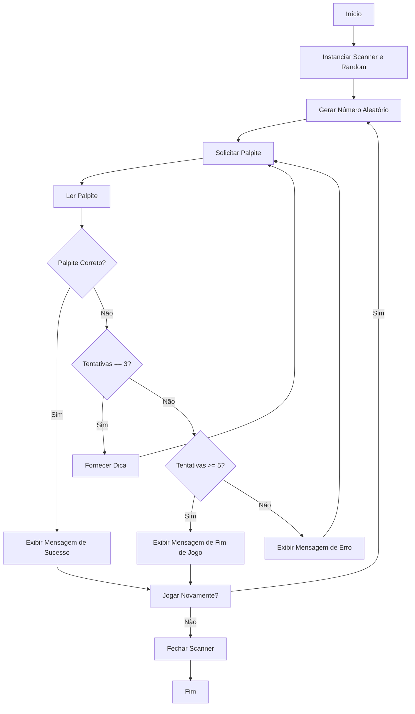

## Desafio 100 dias Codando Java do Básico ao Avançado

# Desafio 4

# Jogo de Adivinhação

Este projeto contém um programa em Java que implementa um jogo de adivinhação, onde o usuário tenta adivinhar um número aleatório gerado pelo programa. Após algumas tentativas, o programa fornece dicas para ajudar o usuário a encontrar o número.

## Autor
- **Msouza472**

## Versão
- **1.0**

## Fluxograma



## Descrição do Código

A classe `JogoAdvinhacao` foi criada para permitir que o usuário tente adivinhar um número aleatório entre 1 e 100. O programa fornece dicas após algumas tentativas para ajudar o usuário a encontrar o número correto.

### Funcionalidades
- Gerar um número aleatório entre 1 e 100.
- Permitir que o usuário tente adivinhar o número.
- Fornecer dicas após 3 tentativas incorretas.
- Limitar o número de tentativas a 5, exibindo o número correto caso o limite seja atingido.
- Permitir que o usuário jogue novamente.

### Como Executar
Para executar o programa, siga estas etapas:

1. Compile o código:
   ```bash
   javac JogoAdvinhacao.java
   ```

2. Execute o programa:
   ```bash
   java JogoAdvinhacao
   ```

### Exemplo de Uso
Ao executar o programa, você verá um prompt pedindo para adivinhar um número entre 1 e 100. Após cada tentativa, o programa fornecerá feedback se o palpite foi muito alto ou muito baixo. Após 3 tentativas incorretas, o programa fornecerá uma dica. Veja um exemplo abaixo:

```
Eu escolhi um número entre 1 e 100. Tente adivinhar!
Digite seu palpite: 50
Muito alto! Tente novamente. Número de tentativas = 1
Digite seu palpite: 25
Muito baixo! Tente novamente. Número de tentativas = 2
Digite seu palpite: 37
Muito alto! Tente novamente. Número de tentativas = 3
Dica: O número que escolhi está entre 28 e 46
Digite seu palpite: 33
Muito baixo! Tente novamente. Número de tentativas = 4
Digite seu palpite: 40
Parabéns! Você adivinhou o número em 5 tentativas.
Deseja jogar novamente? (sim/não): não
```

### Código Fonte

```java
import java.util.Random;
import java.util.Scanner;

/**
 * O programa escolhe um número aleatório e o usuário tem que adivinhar esse número
 * depois de alguns erros o programa dá uma dica para encontrar o número
 * 
 * @author Msouza472
 */
public class JogoAdvinhacao {
    public static void main(String[] args) {
        jogar();
    }

    private static void jogar() {
        Scanner scanner = new Scanner(System.in);
        Random random = new Random();
        String jogarNovamente;

        do {
            int numeroAleatorio = random.nextInt(100) + 1;
            int tentativas = 0;
            int palpite = -1; // Inicializa com um valor diferente para entrar no loop

            System.out.println("Eu escolhi um número entre 1 e 100. Tente adivinhar!");

            while (palpite != numeroAleatorio) {
                System.out.print("Digite seu palpite: ");
                palpite = scanner.nextInt();
                tentativas++;
              
                // Limita o palpite entre 1 e 100
                if (palpite > 100 || palpite < 1) {
                    System.out.println("Erro! Digite um número entre 1 e 100");
                    continue; // Permite que o usuário tente novamente
                }

                if (palpite > numeroAleatorio) {
                    System.out.println("Muito alto! Tente novamente. Número de tentativas = " + tentativas);
                } else if (palpite < numeroAleatorio) {
                    System.out.println("Muito baixo! Tente novamente. Número de tentativas = " + tentativas);
                } else {
                    System.out.println("Parabéns! Você adivinhou o número em " + tentativas + " tentativas.");
                }

                // Verifica se o número de tentativas atinge 3 ou 5 para fornecer dica ou encerrar o jogo
                if (tentativas == 3 && palpite != numeroAleatorio) {
                    System.out.println("Dica: O número que escolhi está entre " + Math.max(1, numeroAleatorio - 9) + " e " + Math.min(100, numeroAleatorio + 9));
                } else if (tentativas >= 5 && palpite != numeroAleatorio) {
                    System.out.println("Você atingiu o limite de " + tentativas + " tentativas. O número era " + numeroAleatorio);
                    break;
                }
            }

            System.out.println("Deseja jogar novamente? (sim/não): ");
            jogarNovamente = scanner.next();
        } while (jogarNovamente.equalsIgnoreCase("sim"));

        scanner.close();
    }
}
```

---

