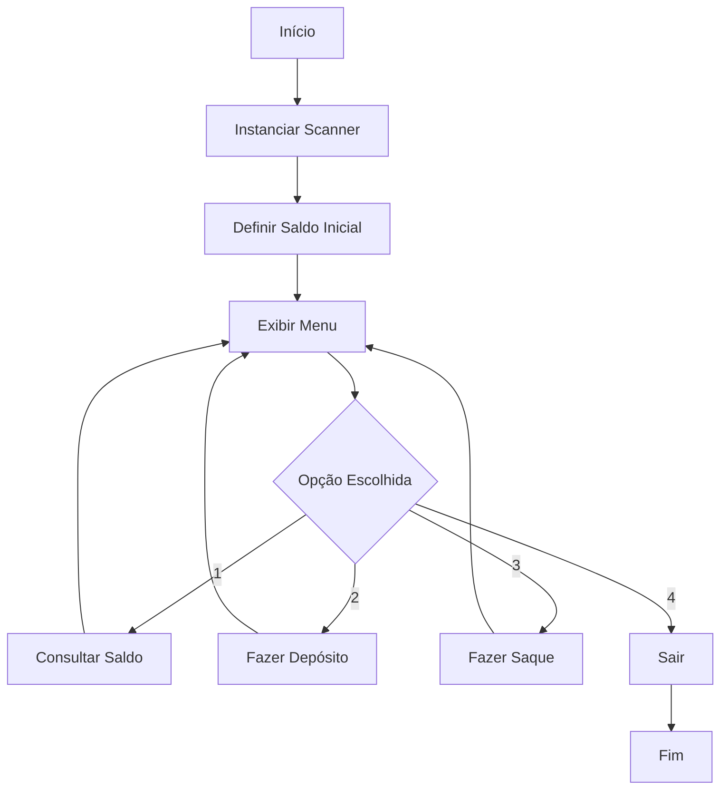

## Desafio 100 dias Codando Java do Básico ao Avançado

# Desafio 5

# Simulação de Caixa Eletrônico

Este projeto contém um programa em Java que simula um caixa eletrônico, permitindo ao usuário consultar saldo, fazer depósitos e realizar saques. O objetivo deste código é demonstrar a manipulação de entradas e saídas de dados, bem como a execução de operações financeiras básicas.

## Autor
- **Msouza472**

## Versão
- **1.0**

## Descrição do Código

A classe `CaixaEletronico` foi criada para simular as funcionalidades básicas de um caixa eletrônico. O programa permite ao usuário definir um saldo inicial, consultar o saldo, fazer depósitos e realizar saques.

## Fluxograma



### Funcionalidades
- Definir um saldo inicial.
- Consultar o saldo atual.
- Fazer depósitos na conta.
- Realizar saques da conta.
- Menu de navegação para acessar as funcionalidades.

### Como Executar
Para executar o programa, siga estas etapas:

1. Compile o código:
   ```bash
   javac CaixaEletronico.java
   ```

2. Execute o programa:
   ```bash
   java CaixaEletronico
   ```

### Exemplo de Uso
Ao executar o programa, você verá um prompt pedindo para definir o saldo inicial. Após definir o saldo, você pode navegar pelo menu para consultar o saldo, fazer depósitos ou realizar saques. Veja um exemplo abaixo:

```
Digite o saldo inicial desejado!
1000.00

Menu Inicial
1. Consultar Saldo
2. Fazer Depósito
3. Fazer Saque
4. Sair
1
O saldo atual da conta é: R$1000.0

Menu Inicial
1. Consultar Saldo
2. Fazer Depósito
3. Fazer Saque
4. Sair
2
Digite o valor do depósito desejado!
200.00
Depósito realizado com sucesso de R$200.0
O seu saldo atual é: R$1200.0

Menu Inicial
1. Consultar Saldo
2. Fazer Depósito
3. Fazer Saque
4. Sair
3
Digite o valor do saque desejado!
150.00
Saque realizado. Seu saldo atual é: R$1050.0

Menu Inicial
1. Consultar Saldo
2. Fazer Depósito
3. Fazer Saque
4. Sair
4
Programa encerrado.
```

### Código Fonte

```java
import java.util.Scanner;

/**
 * Programa Caixa Eletrônico, Faz a simulação de um caixa eletrônico
 * o valor inicial é recebido pelo usuário
 * o usuário pode fazer depósitos e realizar saques
 * 
 * @author Msouza472
 */

public class CaixaEletronico {
    public static double saldo;

    public static void main(String[] args) {
        Scanner scanner = new Scanner(System.in);

        System.out.println("Digite o saldo inicial desejado!");
        
        saldo = scanner.nextDouble();

        int opcao;
        do {
            System.out.println("\nMenu Inicial");
            System.out.println("1. Consultar Saldo");
            System.out.println("2. Fazer Depósito");
            System.out.println("3. Fazer Saque");
            System.out.println("4. Sair");
            opcao = scanner.nextInt();
            

            switch (opcao) {
                case 1:
                    consultarSaldo();
                    break;
                case 2:
                    fazerDeposito(scanner);
                    break;
                case 3:
                    fazerSaque(scanner);
                    break;
                case 4:
                    sair();
                    break;    
                default:
                    System.out.println("Opção inválida, tente novamente.");
                    break;
            }
        } while (opcao != 4);
        scanner.close();
    }

    private static void sair() {
        System.out.println("Programa encerrado.");
    }

    private static void fazerSaque(Scanner scanner) {
        System.out.println("Digite o valor do saque desejado!");
        double saque = scanner.nextDouble();
        if (saque <= saldo) {
            saldo -= saque;
            System.out.printf("Saque realizado. Seu saldo atual é: R$%.2f\n", saldo);
        } else {
            System.out.println("Saldo indisponível. Realize um depósito!");
        }
    }

    private static void fazerDeposito(Scanner scanner) {
        System.out.println("Digite o valor do depósito desejado!");
        double deposito = scanner.nextDouble();
        if (deposito > 0) {
            saldo += deposito;  
            System.out.println("Depósito realizado com sucesso de R$" + deposito);
            System.out.printf("O seu saldo atual é: R$%.2f\n", saldo);
        } else {
            System.out.println("Valor de depósito inválido. Insira um valor positivo.");
        }
    }

    private static void consultarSaldo() {
        System.out.printf("O saldo atual da conta é: R$%.2f\n", saldo);
    }
}
```