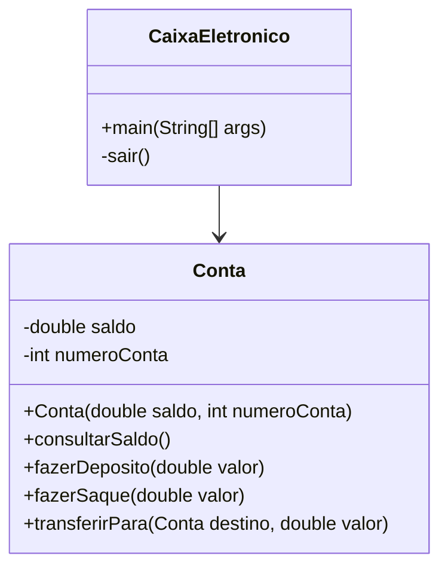

## Desafio 100 dias Codando Java do Básico ao Avançado

# Desafio 6

# Simulação de Caixa Eletrônico com Transferências

### Diagrama de Classes



Este projeto contém um programa em Java que simula um caixa eletrônico com funcionalidades adicionais, permitindo a operação com duas contas e transferências entre elas. O objetivo deste código é demonstrar a manipulação de múltiplas instâncias de classes e a implementação de operações financeiras básicas.

## Autor
- **Msouza472**

## Versão
- **1.0**

## Descrição do Código

A classe `CaixaEletronico` foi criada para simular as funcionalidades básicas de um caixa eletrônico. O programa permite ao usuário definir um saldo inicial para duas contas, consultar o saldo, fazer depósitos, realizar saques e transferir valores entre as contas.

### Funcionalidades
- Definir um saldo inicial para duas contas.
- Consultar o saldo atual de ambas as contas.
- Fazer depósitos nas contas.
- Realizar saques das contas.
- Transferir valores entre as contas.
- Menu de navegação para acessar as funcionalidades.

### Como Executar
Para executar o programa, siga estas etapas:

1. Compile o código:
   ```bash
   javac CaixaEletronico.java Conta.java
   ```

2. Execute o programa:
   ```bash
   java CaixaEletronico
   ```

### Exemplo de Uso
Ao executar o programa, você verá prompts pedindo para definir o saldo inicial para duas contas. Após definir os saldos, você pode navegar pelo menu para consultar saldos, fazer depósitos, realizar saques ou transferir valores entre as contas. Veja um exemplo abaixo:

```
Digite o saldo inicial desejado para a Conta 1: 1000.00
Digite o saldo inicial desejado para a Conta 2: 500.00

Menu Inicial
1. Consultar Saldo Conta 1
2. Consultar Saldo Conta 2
3. Fazer Depósito na Conta 1
4. Fazer Depósito na Conta 2
5. Fazer Saque na Conta 1
6. Fazer Saque na Conta 2
7. Transferir da Conta 1 para Conta 2
8. Transferir da Conta 2 para Conta 1
9. Sair
Escolha uma opção: 1
Saldo da conta 123: R$1000.00
```

### Código Fonte

#### CaixaEletronico.java
```java
import java.util.InputMismatchException;
import java.util.Scanner;

/**
 * Programa Caixa Eletrônico. Faz a simulação de um caixa eletrônico.
 * O valor inicial é recebido pelo usuário.
 * O usuário pode fazer depósitos e realizar saques.
 * Também é possível transferir valores entre duas contas.
 * 
 * @author Msouza472
 */
public class CaixaEletronico {
    public static void main(String[] args) {
        Scanner scanner = new Scanner(System.in);

        System.out.print("Digite o saldo inicial desejado para a Conta 1: ");
        double saldoInicial1 = scanner.nextDouble();
        Conta conta1 = new Conta(saldoInicial1, 123);

        System.out.print("Digite o saldo inicial desejado para a Conta 2: ");
        double saldoInicial2 = scanner.nextDouble();
        Conta conta2 = new Conta(saldoInicial2, 456);

        int opcao = 0;
        do {
            System.out.println("\nMenu Inicial");
            System.out.println("1. Consultar Saldo Conta 1");
            System.out.println("2. Consultar Saldo Conta 2");
            System.out.println("3. Fazer Depósito na Conta 1");
            System.out.println("4. Fazer Depósito na Conta 2");
            System.out.println("5. Fazer Saque na Conta 1");
            System.out.println("6. Fazer Saque na Conta 2");
            System.out.println("7. Transferir da Conta 1 para Conta 2");
            System.out.println("8. Transferir da Conta 2 para Conta 1");
            System.out.println("9. Sair");
            System.out.print("Escolha uma opção: ");
            
            try {
                opcao = scanner.nextInt();
            } catch (InputMismatchException e) {
                System.out.println("Entrada inválida! Por favor, digite um número.");
                scanner.next();  // Limpa a entrada inválida
                continue;
            }

            switch (opcao) {
                case 1:
                    conta1.consultarSaldo();
                    break;
                case 2:
                    conta2.consultarSaldo();
                    break;
                case 3:
                    System.out.print("Digite o valor do depósito para a Conta 1: ");
                    double deposito1 = scanner.nextDouble();
                    conta1.fazerDeposito(deposito1);
                    break;
                case 4:
                    System.out.print("Digite o valor do depósito para a Conta 2: ");
                    double deposito2 = scanner.nextDouble();
                    conta2.fazerDeposito(deposito2);
                    break;
                case 5:
                    System.out.print("Digite o valor do saque para a Conta 1: ");
                    double saque1 = scanner.nextDouble();
                    conta1.fazerSaque(saque1);
                    break;
                case 6:
                    System.out.print("Digite o valor do saque para a Conta 2: ");
                    double saque2 = scanner.nextDouble();
                    conta2.fazerSaque(saque2);
                    break;
                case 7:
                    System.out.print("Digite o valor para transferir da Conta 1 para a Conta 2: ");
                    double transferencia1Para2 = scanner.nextDouble();
                    conta1.transferirPara(conta2, transferencia1Para2);
                    break;
                case 8:
                    System.out.print("Digite o valor para transferir da Conta 2 para a Conta 1: ");
                    double transferencia2Para1 = scanner.nextDouble();
                    conta2.transferirPara(conta1, transferencia2Para1);
                    break;
                case 9:
                    sair();
                    break;   
                default:
                    System.out.println("Opção inválida, tente novamente.");
                    break;
            }
        } while (opcao != 9);
        scanner.close();
    }

    private static void sair() {
        System.out.println("Programa encerrado.");
    }
}
```

#### Conta.java
```java
public class Conta {
    private double saldo;
    private int numeroConta;

    public Conta(double saldo, int numeroConta) {
        this.saldo = saldo;
        this.numeroConta = numeroConta;
    }

    public void consultarSaldo() {
        System.out.printf("Saldo da conta %d: R$%.2f\n", numeroConta, saldo);
    }

    public void fazerDeposito(double valor) {
        if (valor > 0) {
            saldo += valor;
            System.out.printf("Depósito realizado no valor de R$%.2f\n", valor);
            System.out.printf("Saldo atual: R$%.2f\n", saldo);
        } else {
            System.out.println("Valor de depósito inválido");
        }
    }

    public void fazerSaque(double valor) {
        if (valor > 0 && valor <= saldo) {
            saldo -= valor;
            System.out.printf("Saque realizado no valor de R$%.2f\n", valor);
            System.out.printf("Saldo atual: R$%.2f\n", saldo);
        } else {
            System.out.println("Saldo insuficiente ou valor de saque inválido");
        }
    }

    public void transferirPara(Conta destino, double valor) {
        if (valor > 0 && valor <= saldo) {
            saldo -= valor;
            destino.saldo += valor;
            System.out.printf("Transferência de R$%.2f da conta %d para a conta %d realizada com sucesso.\n", valor, numeroConta, destino.numeroConta);
        } else {
            System.out.println("Saldo insuficiente ou valor de transferência inválido.");
        }
    }
}
```

