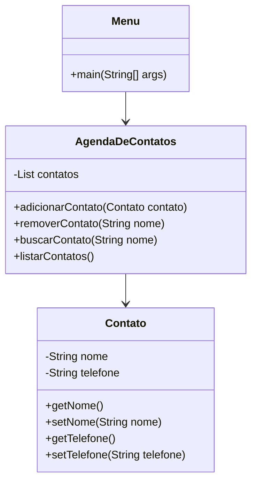

## Desafio 100 dias Codando Java do Básico ao Avançado

# Desafio 7

# Programa Agenda de Contatos

Este projeto contém um programa em Java que simula uma agenda de contatos, permitindo ao usuário adicionar novos contatos, buscar, remover e listar todos os contatos. O objetivo deste código é demonstrar a manipulação de listas e a implementação de operações básicas de gerenciamento de contatos.

### Diagrama de Classes



## Autor
- **Msouza472**

## Versão
- **1.0**

## Descrição do Código

A aplicação consiste em três classes principais:

1. `Contato`: Representa um contato com atributos de nome e telefone.
2. `AgendaDeContatos`: Gerencia uma lista de contatos, permitindo adicionar, remover, buscar e listar contatos.
3. `Menu`: Fornece uma interface de usuário simples para interagir com a agenda de contatos.

### Funcionalidades
- Adicionar um novo contato.
- Remover um contato existente.
- Buscar um contato pelo nome.
- Listar todos os contatos.

### Como Executar
Para executar o programa, siga estas etapas:

1. Compile o código:
   ```bash
   javac Contato.java AgendaDeContatos.java Menu.java
   ```

2. Execute o programa:
   ```bash
   java Menu
   ```

### Exemplo de Uso
Ao executar o programa, você verá um menu com opções para adicionar, remover, buscar e listar contatos. Veja um exemplo abaixo:

```
Olá Usuário escolha uma das opções abaixo!
1- Adicionar Contato
2- Remover Contato
3- Buscar Contatos
4- Listar Contatos
5- Sair
```

### Código Fonte

#### Contato.java
```java
public class Contato {
    private String nome;
    private String telefone;

    public String getNome() {
        return nome;
    }

    public void setNome(String nome) {
        this.nome = nome;
    }

    public String getTelefone() {
        return telefone;
    }

    public void setTelefone(String telefone) {
        this.telefone = telefone;
    }
}
```

#### AgendaDeContatos.java
```java
import java.util.ArrayList;
import java.util.List;

public class AgendaDeContatos {
    private List<Contato> contatos = new ArrayList<Contato>();
    
    public void adicionarContato(Contato contato){
        contatos.add(contato);
        System.out.println("Contato adicionado com sucesso!");
    }

    public void removerContato(String nome){
        Contato contatoParaRemover = null;

        for (Contato contato : contatos) {
            if (contato.getNome().equalsIgnoreCase(nome)) {
                contatoParaRemover = contato;
                break;
            }
        }
        if (contatoParaRemover != null) {
            contatos.remove(contatoParaRemover);
            System.out.println("Contato removido com sucesso!");
        } else {
            System.out.println("Contato não encontrado!");
        }
    }

    public Contato buscarContato(String nome){
        for (Contato contato : contatos){
            if(contato.getNome().equalsIgnoreCase(nome)){
                return contato;
            }
        }
        return null;
    }

    public void listarContatos(){
        if (contatos.isEmpty()) {
            System.out.println("Nenhum contato encontrado");
        } else {
            for(Contato contato : contatos){
                System.out.println("Nome: " + contato.getNome() + " , Telefone: " + contato.getTelefone());
            }
        }
    }
}
```

#### Menu.java
```java
import java.util.Scanner;

/**
 * Programa Agenda de contatos
 * Nesse programa é possível adicionar novos contatos, buscar, remover e listar todos os contatos.
 * 
 * @autor Msouza472
 * @version 1.0
 */
public class Menu {
    public static void main(String[] args) {
        Scanner scanner = new Scanner(System.in);
        AgendaDeContatos agenda = new AgendaDeContatos();
        
        int opcao = 0;

        while (opcao != 5) {
            System.out.println("Olá Usuário escolha uma das opções abaixo!");
            System.out.println("1- Adicionar Contato");
            System.out.println("2- Remover Contato");
            System.out.println("3- Buscar Contatos");
            System.out.println("4- Listar Contatos");
            System.out.println("5- Sair");

            opcao = scanner.nextInt();
            scanner.nextLine();

            switch (opcao) {
                case 1:
                    Contato novoContato = new Contato();
                    System.out.println("Digite o nome");
                    novoContato.setNome(scanner.nextLine());
                    System.out.println("Digite o telefone");
                    novoContato.setTelefone(scanner.nextLine());
                    agenda.adicionarContato(novoContato);       
                    break;
                
                case 2:
                    System.out.println("Digite o nome do contato a ser removido");
                    String nomeRemover = scanner.nextLine();
                    agenda.removerContato(nomeRemover);
                    break;
                case 3:
                    System.out.println("Digite o nome do contato a ser buscado");
                    String nomeBuscar = scanner.nextLine();
                    Contato contatoEncontrado = agenda.buscarContato(nomeBuscar);
                    if (contatoEncontrado != null) {
                        System.out.println("Contato encontrado, nome: " + contatoEncontrado.getNome() + " Telefone: " + contatoEncontrado.getTelefone());            
                    } else {
                        System.out.println("Contato não encontrado!");
                    }
                    break;
                case 4:
                    agenda.listarContatos();
                    break;
                case 5:
                    System.out.println("Saindo.....");
                    break;
                default:
                    System.out.println("Opção inválida, tente novamente");
            }
        }
        scanner.close();
    }
}
```
